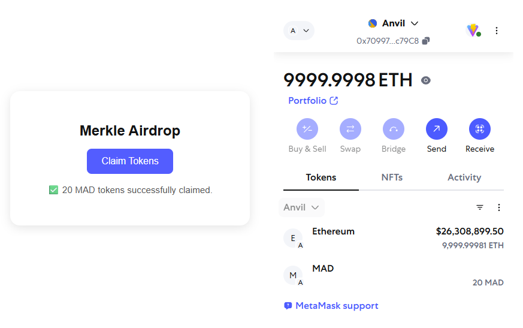

# Merkle Airdrop claim system

[](https://deepwiki.com/edyionescu/merkle-airdrop)


A full-stack Merkle Airdrop system where users can claim tokens only if they're on a whitelist.

Storing a massive airdrop list on-chain is expensive, so the better approach is to use a [Merkle tree](https://blog.ethereum.org/2015/11/15/merkling-in-ethereum). This is a binary tree of hashes where each leaf is a hash of the claim data (e.g., user address + position in the list + amount of tokens they're allowed to claim). The Merkle root is stored on-chain, and users prove their membership by submitting a Merkle proof, which consists of a list of sibling hashes.

### System overview

1. Server ([Express](https://expressjs.com/) with Merkle logic):

   - Stores airdrop data: `address`, `index`, `amount`
   - Returns matching proof data on request

2. Client ([React](https://react.dev/) based DApp frontend, [MetaMask](https://metamask.io/)):

   - Presses a "Claim Tokens" button
   - Sends their address to the server
   - Receives back: `index`, `amount`, `merkleProof`
   - Calls the smart contract's `claim()` method with MetaMask

3. Solidity Contract ([Foundry](https://book.getfoundry.sh/), [OpenZeppelin](https://openzeppelin.com/)):

   - Stores the Merkle root
   - Verifies the Merkle proof
   - Mints tokens to the claimer



## Usage

1. Clone the repository:

   ```bash
   git clone https://github.com/edyionescu/merkle-airdrop.git
   cd merkle-airdrop
   ```

2. Setup contracts:

   ```bash
   cd contracts
   forge install
   make anvil
   make all
   ```

   Note: The [make](https://www.gnu.org/software/make/) utility executes the tasks defined in `/contracts/Makefile`.

3. Setup server:

   ```bash
   cd ../server
   cat .env.example > .env
   npm install
   npm run dev
   ```

   Note: The sample `/server/airdrop-accounts.json` contains the default [Anvil](https://book.getfoundry.sh/anvil/) accounts and their corresponding claim data. Replace with your own data, if needed.

4. Setup client:

   ```bash
   cd ../client

   cat .env.example > .env
   # Replace `VITE_AIRDROP_CONTRACT_ADDRESS` in `.env` with the address of the deployed contract

   npm install
   npm run dev
   ```

5. Visit the application at [`http://localhost:5173/`](http://localhost:5173/).
